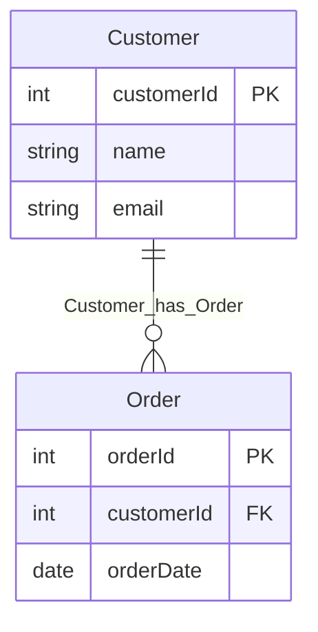

# paip-visualize: Ontology 可视化

## Overview
对应 Palantir 的 Object Explorer / 语义图可视化层：把 `approved/` 中的对象类型、属性（含主键）与链接类型渲染成实体关系图（ER 图），通过 **draw.io MCP**（`mcp__drawio__open_drawio_mermaid` / `open_drawio_xml`）打开图形编辑器。人眼审查语义模型——这是建模质量的最后一道防线（模型结构错误远好于审查前发现而不是审查后返工）。

## When to Use
- 用户说"可视化"、"画个图"、"看看本体结构"
- paip-infer 生成对象模型后、paip-review 审查前（**推荐时机**：先看图再逐项裁决）
- paip-review 审查中，用户要求直观查看对象间关系
- 多源建模后检查"同一实体是否被拆成多个对象"（一眼能看出）

**When NOT to use:**
- staging/approved 为空 → 说明先跑 paip-source/infer
- 用户只要文字清单 → paip-review 的摘要表即可
- 用户要的是数据血缘/管道图（transforms 依赖）→ 说明当前版本只可视化语义模型，转换图后续版本支持

## Steps

### 1. 收集输入
- 读 `approved/objects.json`（若无则读 `staging/objects.json`，并在图上标注"staged 待审查"）
- 读 `approved/links.json`（或 staging 版本）

### 2. 生成 Mermaid ER 图
把对象/属性/链接转成 `erDiagram` 语法：
- 每个对象 → 一个实体块，属性列在块内，主键标注 `PK`
- 每个链接 → 关系连线，带基数（1:N → `||--o{`，N:M → `}o--o{`，1:1 → `||--||`）
- 关系标签用链接 id 或 displayName

示例输出：


### 3. 打开 draw.io
- 调用 `mcp__drawio__open_drawio_mermaid`（content = 生成的 mermaid，`dark: "auto"`）
- draw.io 编辑器打开后，用户在浏览器中查看/微调

### 4. 可选：保存到项目
- 用户要求存档时，把 mermaid 源文本写入 `<项目目录>/diagrams/ontology.mmd`（新建 `diagrams/` 目录），并登记审计事件：
```
node <插件根>/bin/audit.js log <项目目录> visualize ontology_visualized diagrams/ontology.mmd "<N> 对象, <M> 链接"
```

### 5. 与审查衔接
- 提示用户：图已生成，建议带着图进入 paip-review 逐项裁决
- 图中发现的建模问题（重复实体、孤立对象、缺链接）→ 引导用 paip-infer 修订或直接手工改 staging

## Boundaries
- 只读 approved/staging，**不修改**任何模型文件
- 不生成对象/链接（那是 paip-infer）
- 不替用户审查（图是给眼睛看的，决定权在用户）
- 若 draw.io MCP 不可用（未连接）→ 说明需要接 draw.io MCP，退化为文字表格

## Resilience
- 无 links.json：只画对象块（无连线），注明"暂无链接关系"
- 对象无主键：图上标注 `!PK缺失`（审查重点）
- approved 为空但有 staging：用 staging 并明确标注"待审查状态"
- mermaid 语法复杂（长文本属性名）→ 用引号包裹标签；仍失败则用 `open_drawio_xml` 手绘矩形+连线

## Common Mistakes
- 把每列都画成 FK 连线（只有正式 link 类型才连边）
- 不标注 staged/approved 状态（用户会误以为图是最终版）
- 图生成后不衔接审查（可视化是审查的输入，不是终点）
